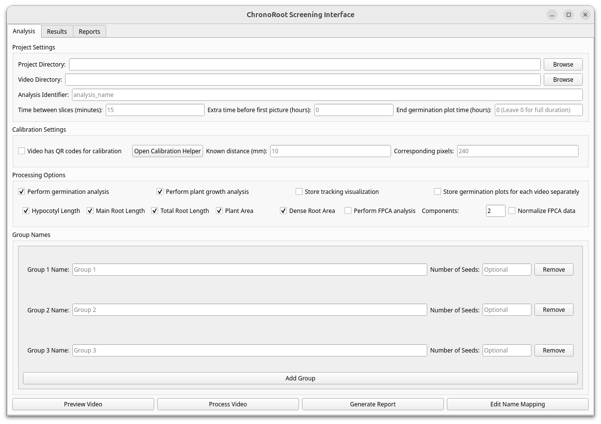

---

## Interface Components

* **Project Directory:** Specifies the storage location for your analysis results. A project encompasses a complete experimental setup involving one or more Raspberry Pi modules.
* **Video Directory:** Identifies the video file for current processing. Videos must be processed sequentially, one at a time.
* **Analysis Identifier:** Identifies the current plate being analyzed.
* **Time Between Slices:** Sets the temporal resolution of the Raspberry Pi module.
* **Extra Time Before First Picture:** Accounts for additional time lost when plates are removed from cold storage or placed under light conditions, ensuring accurate germination timing calculations.
* **End germination plot time (hours):** Specifies the cutoff time for germination analysis.
* **Calibration Settings:** Converts measurements from pixels to millimeters for accurate dimensional analysis.
* **Processing options:** Allows selection between different analysis modes, such as germination, plant measurements and fpca analysis. Includes a button to store tracking visualizations for quality control.
* **Group Names:** Assigns variety identifiers to groups of seeds for experimental organization.

---

## 1. Getting Started

Begin by creating a dedicated folder for storing results, then select the first video from the Demo dataset. A popup window will prompt you to choose the appropriate folders.

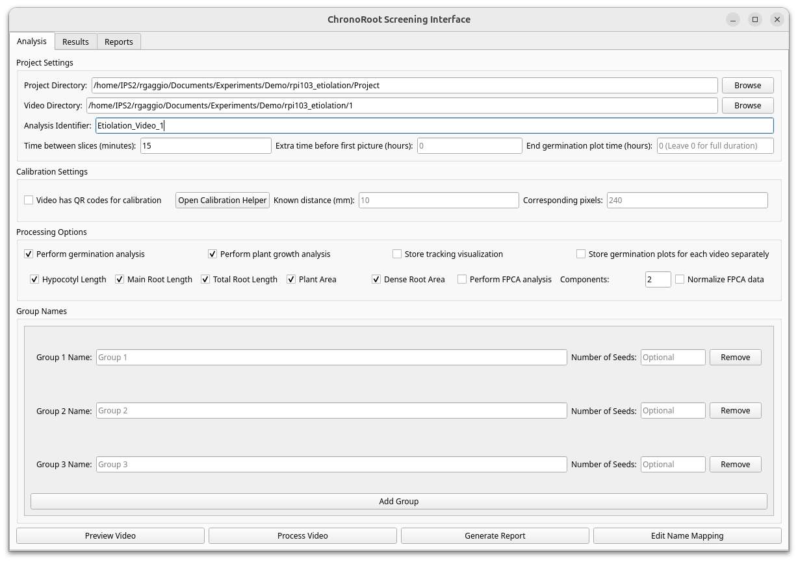

## 2. Video Preview and Configuration

Click the **"Preview Video"** button to view your selected video. Navigate between frames using the scrollbar and press the **"S"** button to toggle the segmentation overlay for visual inspection.

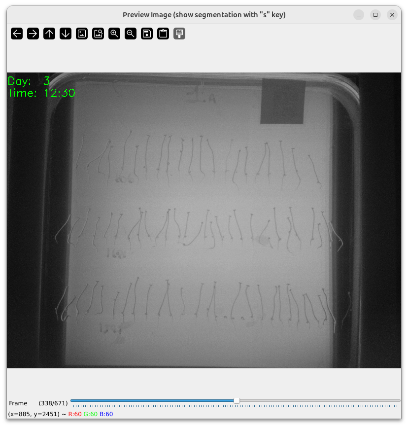

## 3. Calibration Setup

As this video QR codes are not properly visible, we will need to manually calibrate the pixel-to-millimeter ratio.

Measure a known distance for calibration purposes. In this example, the left-to-right distance spans 11 centimeters. Use the calibration tool to determine the pixel-to-millimeter conversion ratio, particularly when QR codes are not present on the plate.

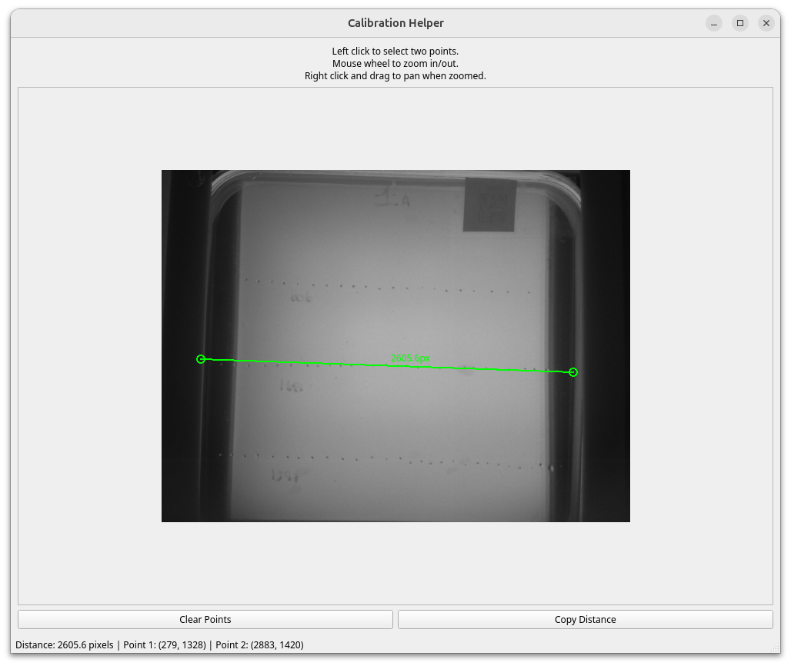

## 4. Processing Options

For this case, we want a complete experimental setup including also global germination analysis. Therefore, select both **"Germination"** and **"Plant growth analysis"** processing options. We will also include FPCA analysis to explore potential growth patterns across different varieties.

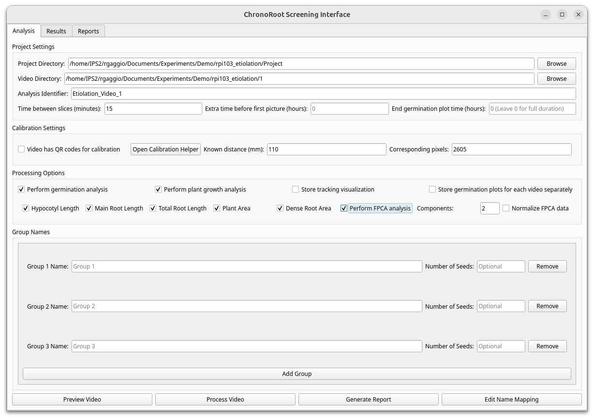

## 5. Group Configuration

Configure the three seed groups according to your experimental design. We can count how many seeds there are in the images, and also check the names of the varieties included in the experiment.

## 6. ROI Selection

Use the **ROI (Region of Interest)** tool to define analysis areas for each of the three seed groups individually.

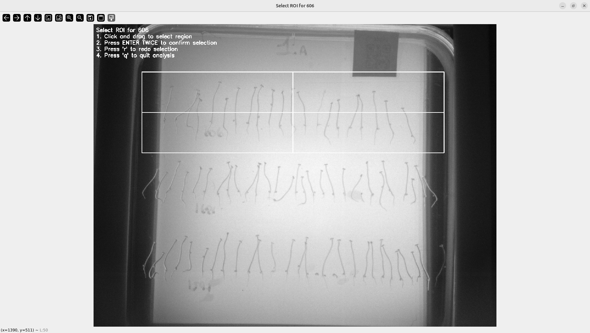

## 7. Results Monitoring

Navigate to the **Results** tab to monitor processing status and track analysis progress throughout the etiolation experiment.

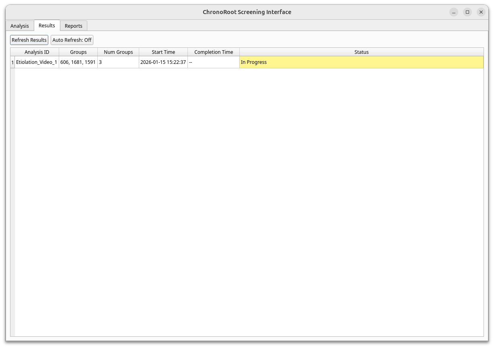

## 8. Generating the Report

Click **"Generate Report"** to generate the comprehensive final report containing all germination, area, root and hypocotyl growth analysis data.

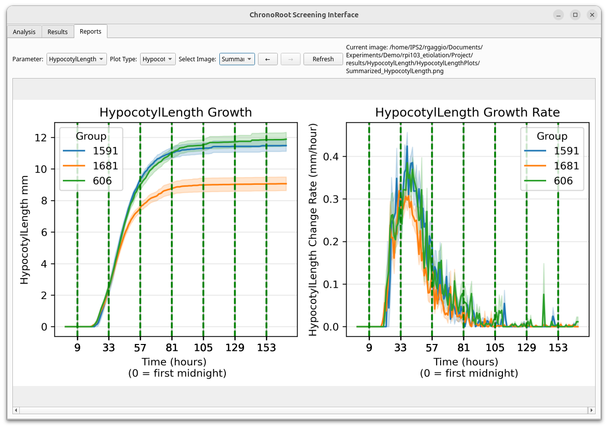

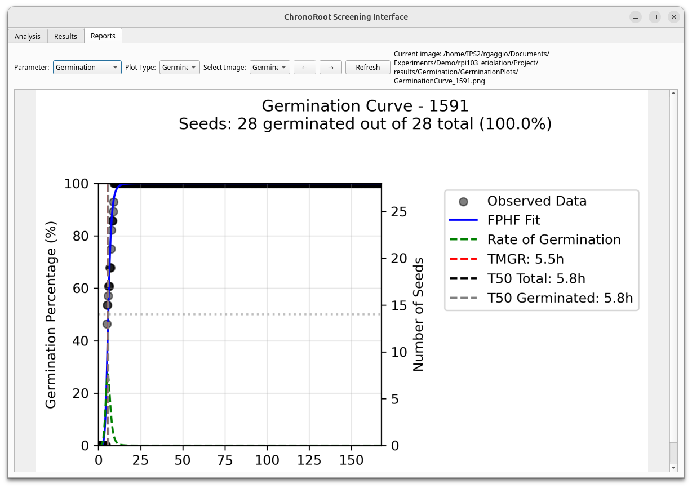

As the video is too long, the germination time is too cramped at the beginning of the plot. We can adjust the **"End germination plot time (hours)"** parameter and reprocess the video to obtain a clearer visualization of germination events. Then, click **"Generate Report"** to update the report.

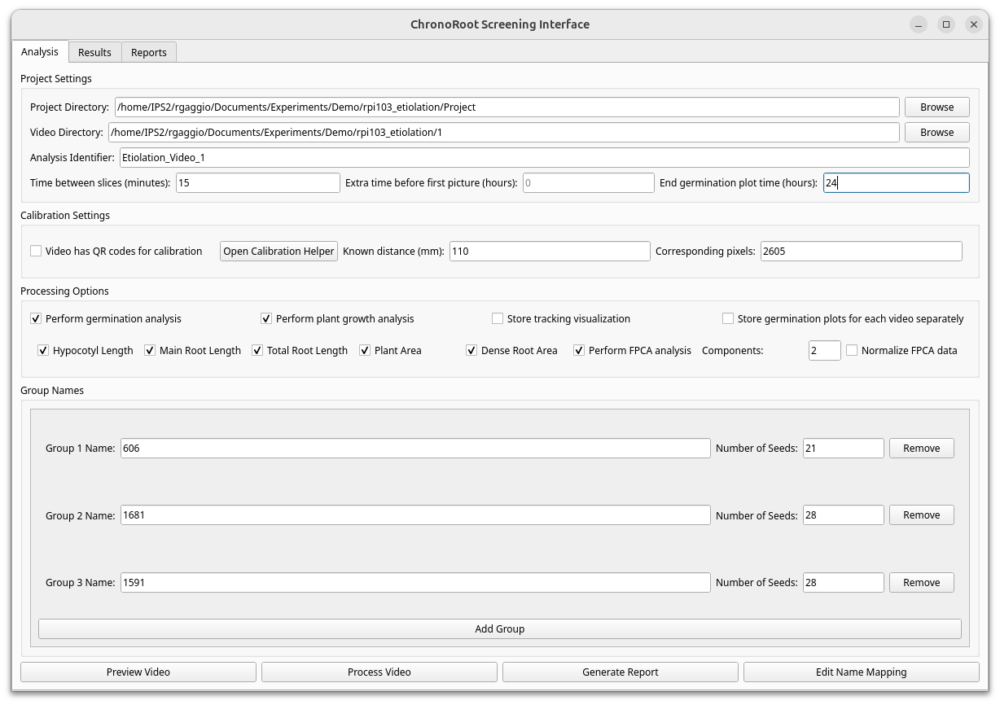
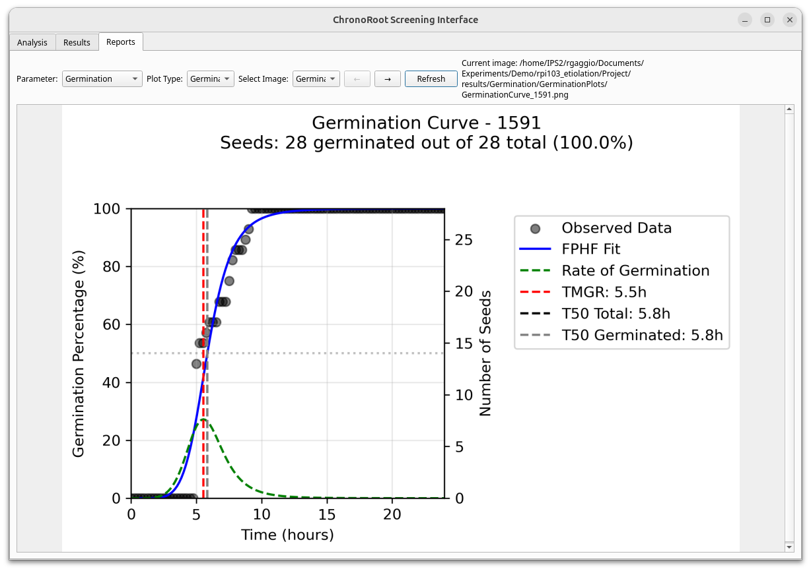