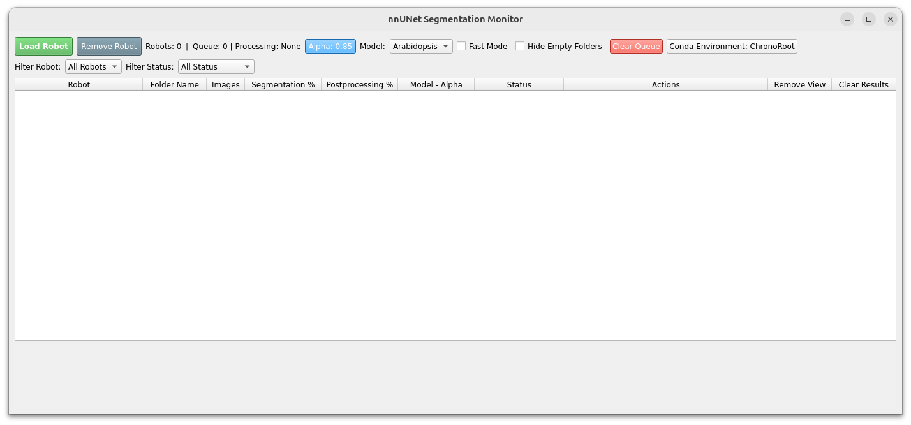
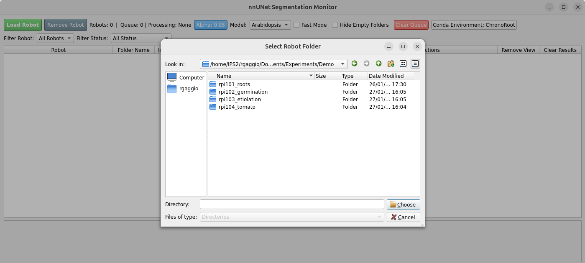
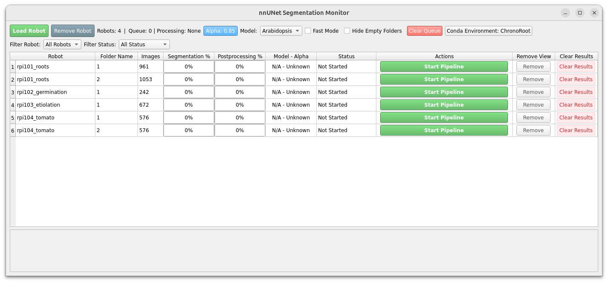
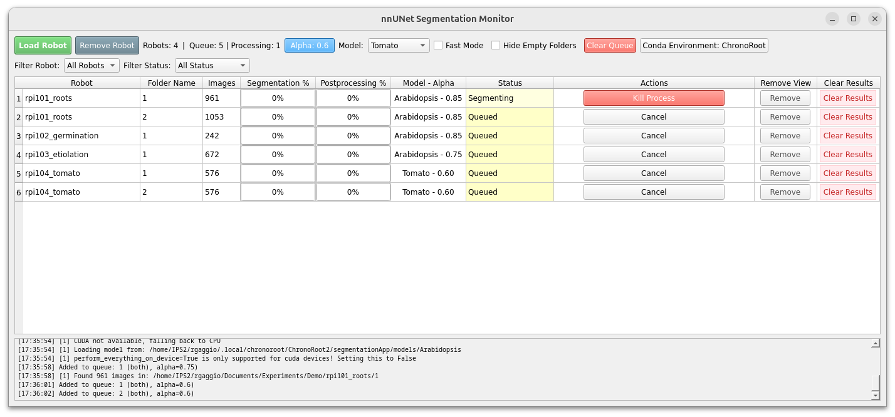

## Graphical User Interface (GUI) Usage

To begin the segmentation process, launch the segmentation interface. This will open the main **ChronoRoot** monitor window.

The interface is divided into the **Header (Configuration)** and the **Table (Monitoring)**. Hover over any button to see a detailed tooltip explanation of its function.



### 1. Configuration & Setup

Before running the pipeline, configure your parameters using the top bar:

* **Load Robot:** Imports data from your experiment folders. This supports **multi-selection**—you can select multiple robot folders at once in the dialog.
* **Remove Robot:** Unloads the currently filtered robot from the view (does not delete files from disk).
* **Model Selector:** Choose the appropriate species model (e.g., *Arabidopsis* or *Tomato*). The list automatically populates from the `models/` directory.
    * *Note:* Changing the model automatically sets the recommended Alpha value.
* **Alpha:** Defines the parameter for the weighted average trailing used in post-processing to ensure temporal stability.
* **Fast Mode:** If checked, disables Test-Time Augmentation (TTA). This results in a 3x speed increase with a minor trade-off in segmentation precision.
* **Hide Empty Folders:** Hides folders that contain no images to declutter the interface.
* **Conda:** Specifies the Anaconda environment name (Default: `ChronoRoot`).

### 2. Loading Data

Begin by loading your dataset. Click **Load Robot** and navigate to your experiment folder. In this demonstration, we load 4 raspberry pi modules where each folder contains one or more time-lapse experiments.



### 3. Monitoring Status & Mismatches

Once loaded, the table displays the progress of every folder. The **Model - Alpha** column shows exactly which parameters were used to generate the existing results.

The **Status** column uses color-coding to indicate the current state:

**Standard Statuses:**

* **Grey (Not Started):** Ready to process.
* **Yellow (Queued):** Waiting for a worker thread.
* **Light Yellow (Segmenting):** Neural network inference is active.
* **Purple (Postprocessing):** Temporal refinement is active.
* **Green (Complete):** Both segmentation and post-processing finished successfully.
* **Orange (Stalled):** The process hasn't updated in a long time (e.g., due to a power outage).
* **Red (Error):** The process failed (check the log panel for details).

**Mismatch Statuses:**
These warnings appear in **Gold** when the settings currently selected in the GUI do not match the metadata of the processed folder:

* **Different Alpha:** The folder was processed with an Alpha value different from the one currently set in the top bar.
* **Different Model:** The folder was segmented using a different model species than the one currently selected.

### 4. Context-Sensitive Actions

The **Actions** column automatically adapts based on the status to suggest the most logical next step:

* **Start Pipeline:** Runs the full process for new folders.
* **Resume:** appears if a process is **Stalled** or had an **Error**, allowing you to continue from the last saved image.
* **Update Alpha:** appears if the status is **Different Alpha**. Clicking this runs *only* the post-processing step with the new value (fast).
* **Rerun Pipeline:** appears if the status is **Different Model**. This re-runs the entire segmentation using the new model.
* **Postproc Only:** appears if the status is **Different Model and Alpha**. This re-runs only the post-processing step with the new Alpha. 
* **Kill Process:** appears if a job is currently running, allowing you to force-stop it.

*(Far Right)* **Clear Results:** This button **permanently deletes** the segmentation output folder for that row, allowing for a completely fresh start.





## Command Line Interface (CLI) Usage

If you prefer working in a headless environment, automating tasks, or simply wish to avoid the graphical interface, you can perform segmentation directly via the command line using `cli.py`.

**Prerequisites:**
Before running the commands below, ensure you have loaded the `ChronoRoot` environment.

### Basic Usage

The basic syntax requires pointing the script to your input folder and specifying the model name.

```bash
python cli.py /path/to/your/images --model Arabidopsis
```

### Common Examples

**1. Standard Arabidopsis Segmentation**
Runs the default segmentation for Arabidopsis using the GPU.

```bash
python cli.py /path/to/dataset --model Arabidopsis
```

**2. Tomato Segmentation in Fast Mode**
Use this for Tomato datasets if you want faster results (skips test-time augmentation).

```bash
python cli.py /path/to/dataset --model Tomato --fast
```

**3. Custom Post-processing**
If you need to adjust the **Alpha** parameter (weighted average trailing) specifically for your dataset:

```bash
python cli.py /path/to/dataset --model Arabidopsis --alpha 0.90
```

### Argument Reference

| Argument | Description | GUI Equivalent |
| --- | --- | --- |
| `input` | **Required.** Path to the folder containing images. | "Load Robot" |
| `--model`, `-m` | **Required.** The specific model to use (must match a folder in `models/`). | "Species selector" |
| `--fast` | Disables test-time augmentation for 3x speed (slight performance cost). | "Fast Mode" |
| `--alpha`, `-a` | Set the alpha parameter for post-processing logic. | "Alpha" |
| `--device` | Specify hardware: `cuda` (default), `cpu`, or `mps`. | N/A |
| `--postprocess-only` | Skip segmentation and rerun post-processing on existing results. | "Actions -> Postproc Only" |
| `--resume` | Resume a stopped run using existing metadata. | "Actions -> Resume Pipeline" |

### Output Structure

The CLI will create a `Segmentation` folder inside your input directory, organizing results exactly as the GUI does:
`input_path/Segmentation/Fold_0`


